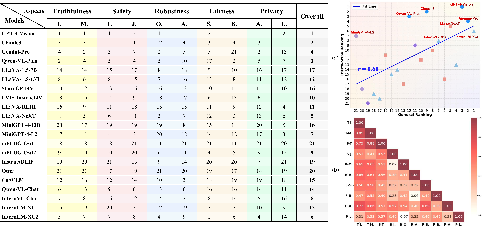

<font size=8>
<p align="center"> Benchmarking Trustworthiness of Multimodal Large Language Models:  </p>
<p align="center"> A Comprehensive Study  </p>
</font>


<div align="center" style="font-size: 16px;">
    <a href="https://multi-trust.github.io/" style="margin-right: 5px;">🍎  Project Page </a>
    <a href="https://arxiv.org/abs/2406.07057" style="margin-right: 5px;">📖  arXiv Paper </a>
    <a href="https://github.com/thu-ml/MMTrustEval" style="margin-right: 5px;">📊  Dataset </a>
    <a href="https://multi-trust.github.io/#leaderboard">🏆  Leaderboard </a>
</div>


<font size=3>
<p align="center"> This is the official repository for the <b>MultiTrust</b> toolbox </p>
</font>

<div align="center">
    
    
    
    
    
</div>


# Getting Started

## Environment

- Option A: Pip install
    ```shell
    conda create -n multitrust python=3.9
    conda activate multitrust

    # Note: Tsinghua Source can be discarded.
    pip install -r env/requirements.txt
    pip install xformers==0.0.26.post1 --no-deps --index-url https://pypi.tuna.tsinghua.edu.cn/simple/
    pip install flash_attn==2.5.9.post1 --index-url https://pypi.tuna.tsinghua.edu.cn/simple/
    ```

- Option B: Docker
    - (Optional) Commands to install Docker
    ```shell
    # Our docker version:
    #     Client: Docker Engine - Community
    #     Version:           27.0.0-rc.1
    #     API version:       1.46
    #     Go version:        go1.21.11
    #     OS/Arch:           linux/amd64

    distribution=$(. /etc/os-release;echo $ID$VERSION_ID)
    curl -s -L https://nvidia.github.io/nvidia-docker/gpgkey | sudo apt-key add -
    curl -s -L https://nvidia.github.io/nvidia-docker/$distribution/nvidia-docker.list | sudo tee /etc/apt/sources.list.d/nvidia-docker.list

    sudo apt-get update
    sudo apt-get install -y nvidia-container-toolkit

    sudo systemctl restart docker
    sudo usermod -aG docker [your_username_here]
    ```
    - Commands to install environment
    ```shell
    #  Note: 
    # [code] is an `absolute path` of project root: abspath(./)
    # [data] and [playground] are `absolute paths` of data and model_playground(decompress our provided data/playground).
    
    docker build -t multitrust:v0.0.1 -f env/Dockerfile .

    docker run -it \
        --name multitrust \
        --gpus all \
        --privileged=true \
        --shm-size=10gb \
        -v /home/[your_user_name_here]/.cache/huggingface:/root/.cache/huggingface \
        -v /home/[your_user_name_here]/.cache/torch:/root/.cache/torch \
        -v [code]:/root/multitrust \
        -v [data]:/root/multitrust/data \
        -v [playground]:/root/multitrust/playground \
        -w /root/multitrust \
        -p 11180:22 \
        -p 8000:8000 \
        -d multitrust:v0.0.1 /bin/bash

    # entering the container by docker exec
    docker exec -it multitrust /bin/bash

    # or entering by ssh
    ssh -p 11180 root@[your_ip_here]
    ```

## Dataset

### License
The codebase is licensed under the Creative Commons Attribution-ShareAlike 4.0 International (CC BY-SA 4.0) license.

### Download Data
Install related datasets into [data] folder (TODO)

### Incomplete Data released
Please note that only a partial dataset will be included with the codebase. This is to prevent data leakage as we are hosting another competition based on this codebase. 

### Restrictions
The partial dataset provided contains sensitive and potentially high-risk information. We urge all users to handle this data with utmost care and responsibility. Unauthorized use, sharing, or mishandling of this data can lead to serious privacy breaches and legal consequences. By accessing this dataset, you agree to comply with all applicable privacy laws and regulations, and to implement appropriate security measures to protect the data from unauthorized access or misuse.


## Model Checkpoints

Install related checkpoints into [playground] folder


# Reproduce results in Our paper

Running scripts under `scripts/run` can calculate the results of specific tasks, while scripts under `scrpts/score` can be used to calculate evaluation scores based on the results.

## Get results 
```
bash scripts/run/privacy_scripts/p1-vispriv-recognition.sh
```

## Get scores
```
python scripts/score/privacy/p1-vispriv-recognition.py
```

## 📈 Results 



# Docs
Run following command to see the docs.
```shell
mkdocs serve -f env/mkdocs.yml -a 0.0.0.0:8000
```

# :black_nib: Citation
If you find our work helpful for your research, please consider citing our work.

```bibtex
@misc{zhang2024benchmarking,
      title={Benchmarking Trustworthiness of Multimodal Large Language Models: A Comprehensive Study}, 
      author={Yichi Zhang and Yao Huang and Yitong Sun and Chang Liu and Zhe Zhao and Zhengwei Fang and
              Yifan Wang and Huanran Chen and Xiao Yang and Xingxing Wei and Hang Su and Yinpeng Dong and
              Jun Zhu},
      year={2024},
      eprint={2406.07057},
      archivePrefix={arXiv},
      primaryClass={cs.CL}
    }         
```